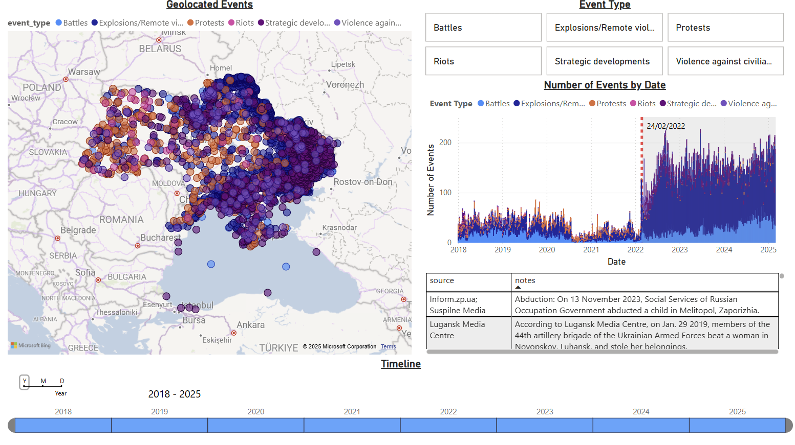
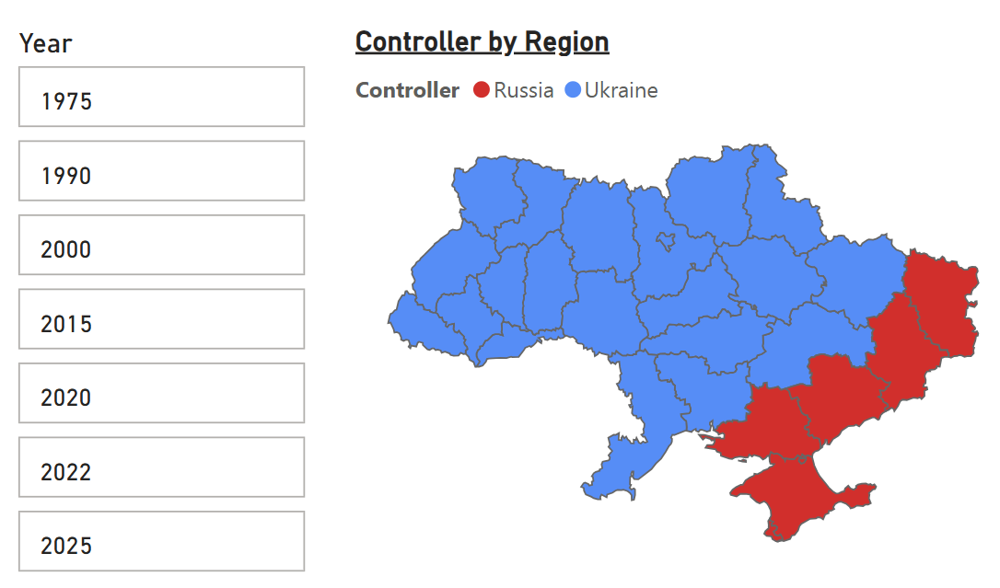
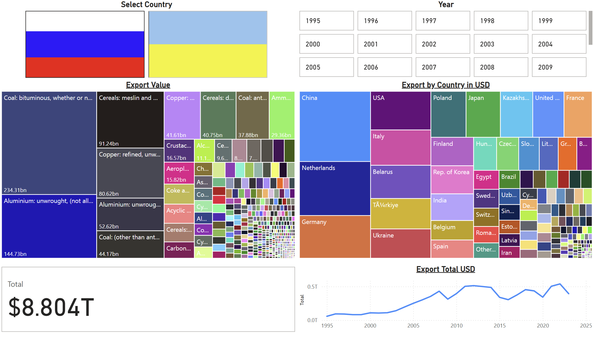
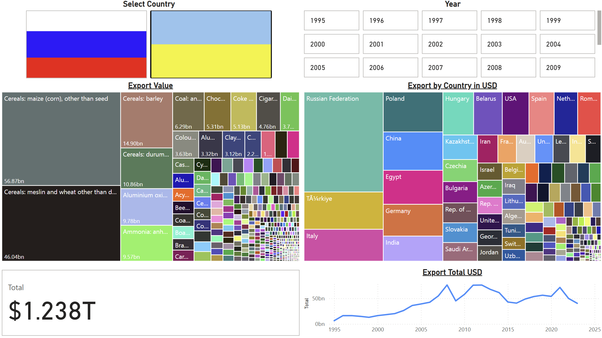

# Russia-Ukraine-February2025
## Overview
This repository contains a Power BI Desktop file and supporting analysis that models the current conflict between Russia and Ukraine using various datasets. The analysis focuses on geolocated data, population statistics, and refugee data to understand the ongoing situation and predict future trends.

## Data Sources

### Geolocated Data
I used geolocated data to map and model the areas most affected by the ongoing conflict. This data helps provide insights into regions that have experienced significant change, both in terms of displacement and infrastructural damage. By using geographic visualizations, I could better understand the spatial dynamics of the conflict over time.

### Population Figures
Population figures were sourced from Worldometer, a trusted and up-to-date source for population data. These statistics were used to analyze the demographic impact of the conflict.

## Analysis of Ukrainian Age Demographics and Urbanization 

The ongoing war in Ukraine, especially since 2014 and the full-scale invasion in 2022, has led to a significant decline in the rural population. Conflict in eastern and southern Ukraine has caused widespread displacement, with many people fleeing rural areas for safety and better opportunities in urban centres. This has accelerated rural depopulation, particularly in war-affected regions.

In contrast, Ukraine's urban population has remained stable, as cities like Kyiv, Lviv, and Odesa have continued to attract people seeking refuge and employment. While metropolitan areas face challenges from the influx of internally displaced persons, they have remained resilient due to better infrastructure and services. This trend of migration from rural to urban areas has intensified urbanization, even amid the war. This explains the data showing a rapid decrease in the rural population after the invasion started.

The war in Ukraine should have contributed to an increasing median age as many young people, particularly from conflict zones, have migrated to cities or abroad for safety and opportunities. Additionally, the loss of life among younger men involved in the conflict has further reduced the youth population. As a result, the ageing of Ukraine’s population has accelerated, with fewer young people and a growing elderly population, leading to a higher median age. However, this isn't clearly shown in the data as both young and old are leaving in high numbers with middle-aged Ukrainians staying for the war effort and to keep the economy stable.

This data was sourced from Worldometer has estimates of Ukrainian population figures. However, this is based on the de jure borders of Ukraine and not the current de facto situation in which Russia controls territory in the regions of Crimea, Donetsk, Luhansk, Zaporizhzhia, Kherson and a minor amount in the Kharkiv Oblast. This will be looked into next.

### Refugee Data
Refugee statistics were sourced from UNHCR, the UN Refugee Agency, which provides reliable and authoritative data on refugees and displaced persons. This data was invaluable in understanding the scope of displacement caused by the conflict, including the number of refugees fleeing Ukraine and seeking asylum in neighboring countries.

## Methodology

### City-Fact Data and Linear Regression
To model the population trends of Ukraine, I utilized City-Fact data, which provided key demographic and economic information about cities in Ukraine. Linear regression models were then employed using Python to estimate the population of Ukraine for the years 2020, 2022, and 2025. These estimates were important for predicting population changes due to the conflict and understanding the longer-term effects on Ukraine’s demographic landscape.

#### Steps Taken:
1. **Data Collection**: I gathered city-level population data from City-Fact and aggregated it by region.
2. **Data Processing**: The population data was cleaned and normalized to account for any discrepancies in reporting.
3. **Linear Regression**: Using Python, I implemented a linear regression model to estimate population changes from 2020 through 2025.
   - The model accounted for both historical trends and the impact of the conflict on population displacement.
#### Analysis
Data only is available up to 2015 for the population of each Oblast. For this analysis, I will assume population trends continue for each region until 2022 when the Russian invasion started. The refugee statistics were added to the predicted data and compared to the estimated Ukranian population data from Worldometer. Using linear regression population estimates for 2020,2022 and 2025 based on the previous regional data. Doing so gives an estimation of what the population would have been if no invasion had taken place. Using the data from Ukranian migration taking effect in 2022.

Due to a lack of data on the specifics of which of these migrants originate from assumptions must be made for further analysis. For Russia, I will assume population losses from the land it controls are mitigated by the number of Ukranian citizens that decide to flee to Russia so I will be treating the Russian-controlled sectors to have no loss due to the amount of Ukranians moving to Russia. 

For the rest of the refugees it is assumed they have not gone to Russia this total is 5,614,691 that have fled to Western countries. This amount will be taken from the projected Ukrainians living in de facto Ukraine in proportion to the population.

The data produced for the population estimate with losses match the Worldometer data, however, this data can be misleading as it presents Ukrainians that are under Russian control. A better metric is the population under Ukrainian control withy losses factored in dropping the population to 28,182,869 this represents the population to which the Ukrainian government has access. This marks a fall from 45,784,896 in 2015 (including Crimea) totalling a drop to 61.55% of pre conflict governed population.

### Exports of Ukraine and Russia
In addition to population models, I also focused on the economic impacts of the conflict, particularly in terms of exports. I used historical export data for both Russia and Ukraine to model changes in trade patterns. The conflict has had a significant impact on the export industries of both countries, particularly in the energy, agricultural, and industrial sectors.

#### Export Modeling:
1. **Data Gathering**: Export data was collected from international trade databases HS92 from cepii and supplemented with open-source statistics.
2. **Analysis**: I used time-series analysis to identify trends and deviations in export levels before and after the conflict began.

## Exports of Ukraine (1995-2022)
From 1995 to 2000, Ukraine was in the midst of transitioning from a Soviet-style centrally planned economy to a market-driven one. During this time, the country's exports were primarily focused on steel, chemicals, and agricultural products, including grain. The export market was still largely reliant on Russia and other former Soviet republics. As Ukraine moved into the 2000s, the period between 2000 and 2013 saw steady economic growth, with an increasing share of exports coming from metals, machinery, and agricultural products such as wheat and corn. Ukraine became a significant player in the global grain market, and the EU started to play a more prominent role in Ukraine's trade relations.

However, the outbreak of the Russia-Ukraine war in 2014 and the annexation of Crimea significantly disrupted Ukraine's exports. Trade with Russia, once a key economic partner, was severely reduced, and Western sanctions compounded the economic challenges. During this time, Ukraine began to shift its focus towards the European Union, with exports to the EU rising, particularly in agricultural products like grain, sunflower oil, and steel. Despite these shifts, the conflict in eastern Ukraine and the Russian annexation of Crimea continued to strain the economy. In the years following, especially from 2015 to 2019, Ukraine found new markets for its goods, including key agricultural exports, and EU became Ukraine’s largest trading partner.

The period from 2020 to 2022 saw even more severe disruptions due to the ongoing war with Russia. The 2022 invasion of Ukraine led to a blockade of Ukrainian ports on the Black Sea, significantly affecting the country's ability to export critical goods like grain. While agriculture remained Ukraine's main export sector, its overall export volume plummeted due to the war, which further disrupted supply chains and trade routes.

## Exports of Russia (1995-2022)
Russia's export economy has long been dominated by natural resources, particularly oil, natural gas, and metals. From 1995 to 2000, Russia’s economy was still in a transition phase following the collapse of the Soviet Union. The country heavily relied on energy exports, especially oil and gas, which became its primary sources of revenue. While Russia's economy during this period was still somewhat limited in terms of diversification, the country’s natural resource wealth began to make it an important global player, particularly in energy markets. By 2000-2013, Russia experienced rapid growth in its energy exports. Its oil and natural gas sectors grew substantially, making Russia one of the world's largest suppliers of energy, particularly to Europe. Alongside energy, Russia also began to increase exports of metals, chemicals, and agricultural products.

The geopolitical tensions of 2014 marked a turning point for Russia’s economy, particularly with the annexation of Crimea and its involvement in the conflict in Eastern Ukraine. In response, the West imposed sanctions on Russia, targeting various sectors of its economy, including energy, banking, and defense. Despite these sanctions, Russia’s energy exports continued to be a crucial pillar of its economy, especially to Europe and later to China. Russia also sought to strengthen economic ties with China and other countries outside the Western sphere, mitigating some of the effects of sanctions. Between 2015 and 2019, energy exports remained resilient, and Russia’s agricultural exports also grew, particularly in wheat and other grains.

The period from 2020 to 2022 saw increased strain on Russia’s export economy, especially after the full-scale invasion of Ukraine in 2022. In response to Russia’s actions, Western countries imposed even stricter sanctions, targeting key sectors, including energy exports. While Russia continued to be a major supplier of oil and natural gas, its exports to Europe faced significant reductions due to embargoes and sanctions. Despite these setbacks, Russia remained a major energy supplier to China and other non-Western countries. Other sectors, such as metals and grain, continued to be important for Russian exports, although sanctions limited access to critical technology and other high-tech exports.

## Key Insights
### Geolocated Data & Conflict Impact:
The analysis utilized geolocated data to visually map areas most affected by the Russia-Ukraine conflict. These visualizations help identify regions experiencing displacement, infrastructural damage, and significant demographic changes. By tracking the conflict's spatial dynamics, it provides deeper insights into how the war has reshaped both population movements and territorial control.

### Population Trends & Migration:

The conflict has caused massive rural depopulation, particularly in the eastern and southern regions of Ukraine, as people flee to urban centers for safety and economic opportunities. This trend has accelerated urbanization, despite the ongoing war.

The war has also led to a higher median age in Ukraine as many young people have left conflict zones or migrated abroad, while the elderly population remains more in the country. This demographic shift presents long-term implications for Ukraine’s workforce and economic recovery.

### Refugee Displacement:

Using UNHCR refugee data, the analysis highlights the large-scale displacement of Ukrainian citizens, with over 5.6 million fleeing to Western countries due to the war. The refugee movement significantly affects Ukraine's population figures, especially in regions now under Russian control. The displacement creates additional strain on neighboring countries and impacts Ukraine’s future population trajectory.

### City-Fact Data & Linear Regression for Population Modeling:

To estimate future population trends, the analysis incorporated city-level demographic data and employed linear regression models. These models predict population changes for 2020, 2022, and 2025, showing a decline in population due to both migration and deaths caused by the war.
The model indicates that, due to migration patterns and the loss of territory, Ukraine's population under its control may have dropped by 38.45%, a significant blow to the country's demographic stability.

### Exports of Ukraine (1995-2022):

Ukraine’s exports have shifted significantly, particularly after the annexation of Crimea in 2014. The country’s reliance on Russia for exports has decreased, while its trade relations with the European Union have strengthened. However, the ongoing war, especially the 2022 invasion, has severely disrupted Ukraine's export capabilities, particularly in agriculture, due to port blockages and supply chain disruptions.

Agriculture remains a key export sector, but the volume has drastically reduced due to the war. Ukraine is now facing a future where its exports will need to adapt to a smaller economy and altered territorial boundaries.

### Exports of Russia (1995-2022):

Russia’s export economy has been driven by energy resources (oil, natural gas) since the post-Soviet period. While Russia experienced growth in energy exports and metals, the geopolitical tensions resulting from the annexation of Crimea in 2014 and the 2022 invasion of Ukraine caused significant shifts in trade relations.

Sanctions imposed by Western countries after the invasion of Ukraine, particularly in energy exports, have affected Russia’s economy, but Russia has redirected its exports to China and other non-Western countries. Despite sanctions, Russia remains a significant player in global energy markets.

Russia’s agricultural exports have grown in recent years, particularly wheat, but export restrictions and challenges in high-tech industries due to sanctions have limited Russia's overall growth in non-energy sectors.

### Impact of the Conflict on Exports:

The ongoing war has disrupted trade for both countries, with Ukraine’s agricultural exports severely impacted by the blockade of ports and territorial losses. Russia’s energy exports to Europe have reduced, but the country has sought to mitigate this by diversifying markets, particularly in China and Asia.

Both countries face long-term challenges in rebuilding their economies and securing stable trade relationships as the conflict continues to shape their futures.

## Conclusion

The ongoing Russia-Ukraine conflict has had profound impacts on both countries' demographics and economies. The war has led to significant population displacement, with rural areas in Ukraine experiencing severe depopulation while urban centers grow due to internal migration. Refugee outflows have further altered the demographic landscape, with millions fleeing to neighboring countries. Using linear regression, we estimated population trends for Ukraine, predicting a sharp decline in population due to the conflict.

Economically, both countries have faced disruptions in their export industries. Ukraine’s agricultural exports, particularly grain, have been heavily affected by the war, while Russia’s energy exports continue to be impacted by international sanctions. Despite the challenges, both countries have adapted by shifting trade partners, with Russia increasing its trade with China and other non-Western nations.

This analysis provides valuable insights into the long-term consequences of the conflict on Ukraine and Russia, both in terms of demographic shifts and economic resilience.

## Sources
https://www.cepii.fr/DATA_DOWNLOAD/baci/data/BACI_HS92_V202501.zip - Export data 

https://www.worldometers.info/demographics/ukraine-demographics/ - Woldometer data 

https://www.city-facts.com/ukraine/population - local ukrainian data 1975-2015

https://data.unhcr.org/en/situations/ukraine?utm - UN refugee data 

https://liveuamap.com/?ll=48.11679266819489;37.739980468749984&zoom=8 - war mapping 

https://github.com/NickTimosh/Ukraine_Map_PowerBI - ukraine map source 
