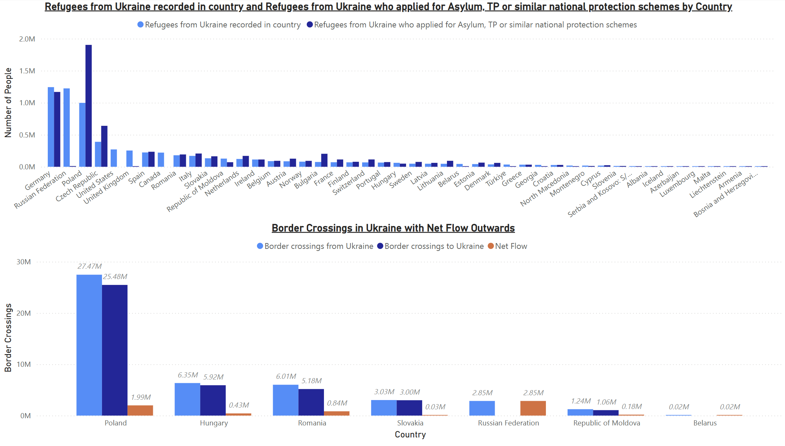

# Russia-Ukraine-February2025
## Overview
This repository contains a Power BI Desktop file and supporting analysis that models the current conflict between Russia and Ukraine using various datasets. The analysis focuses on geolocated data, population statistics, and refugee data to understand the ongoing situation and predict future trends.

## Data Sources

### Geolocated Data
I used geolocated data to map and model the areas most affected by the ongoing conflict. This data helps provide insights into regions that have experienced significant change, both in terms of displacement and infrastructural damage. By using geographic visualizations, I could better understand the spatial dynamics of the conflict over time.

### Population Figures
Population figures were sourced from Worldometer, a trusted and up-to-date source for population data. These statistics were used to analyze the demographic impact of the conflict.

### Refugee Data
Refugee statistics were sourced from UNHCR, the UN Refugee Agency, which provides reliable and authoritative data on refugees and displaced persons. This data was invaluable in understanding the scope of displacement caused by the conflict, including the number of refugees fleeing Ukraine and seeking asylum in neighboring countries.

## Methodology

### City-Fact Data and Linear Regression
To model the population trends of Ukraine, I utilized City-Fact data, which provided key demographic and economic information about cities in Ukraine. Linear regression models were then employed using Python to estimate the population of Ukraine for the years 2020, 2022, and 2025. These estimates were important for predicting population changes due to the conflict and understanding the longer-term effects on Ukraine’s demographic landscape.

#### Steps Taken:
1. **Data Collection**: I gathered city-level population data from City-Fact and aggregated it by region.
2. **Data Processing**: The population data was cleaned and normalized to account for any discrepancies in reporting.
3. **Linear Regression**: Using Python, I implemented a linear regression model to estimate population changes from 2020 through 2025.
   - The model accounted for both historical trends and the impact of the conflict on population displacement.

### Exports of Ukraine and Russia
In addition to population models, I also focused on the economic impacts of the conflict, particularly in terms of exports. I used historical export data for both Russia and Ukraine to model changes in trade patterns. The conflict has had a significant impact on the export industries of both countries, particularly in the energy, agricultural, and industrial sectors.

#### Export Modeling:
1. **Data Gathering**: Export data was collected from international trade databases and supplemented with open-source statistics.
2. **Analysis**: I used time-series analysis to identify trends and deviations in export levels before and after the conflict began.
3. **Predictive Modeling**: Using regression analysis, I modeled the potential future export scenarios for both countries, factoring in sanctions, trade disruptions, and geopolitical dynamics.

## Key Insights

- The population of Ukraine has been significantly impacted by the ongoing conflict, with large-scale displacement both internally and to neighboring countries.
- The number of refugees has escalated, with neighboring countries hosting millions of displaced individuals.
- The conflict has drastically altered Ukraine’s export patterns, particularly in agriculture and energy exports. Russia has similarly seen shifts in its economic and export activities due to international sanctions.
- The linear regression models predict continued population decline in Ukraine for the near future, particularly in conflict zones.

## Conclusion

This analysis provides a data-driven perspective on the Russia-Ukraine conflict, using a combination of geolocated data, population figures, refugee statistics, and export data. The predictive models offer insights into the potential demographic and economic outcomes of the conflict, which can inform future decisions in both humanitarian and policy-making contexts.

## Files in This Repository

- `Russia_Ukraine_Conflict_Analysis.pbix` — Power BI Desktop file with visualizations of the data.
- `Population_Model.py` — Python script implementing linear regression for population estimation.
- `Export_Model.py` — Python script modeling exports of Ukraine and Russia.
- `Data/` — Directory containing raw and cleaned data used for analysis.
